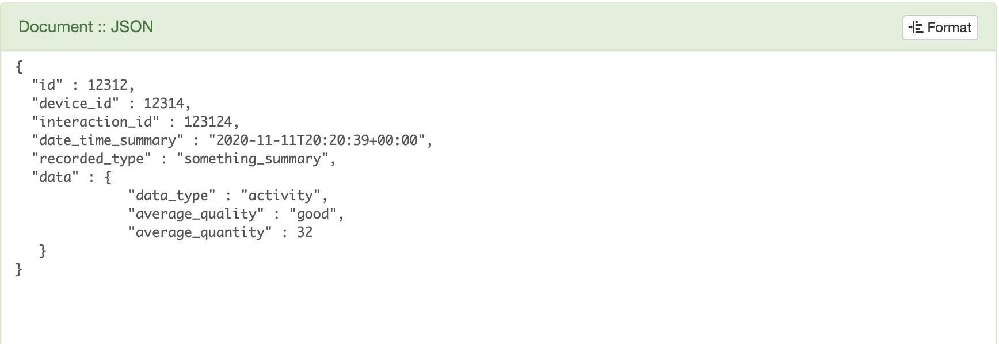
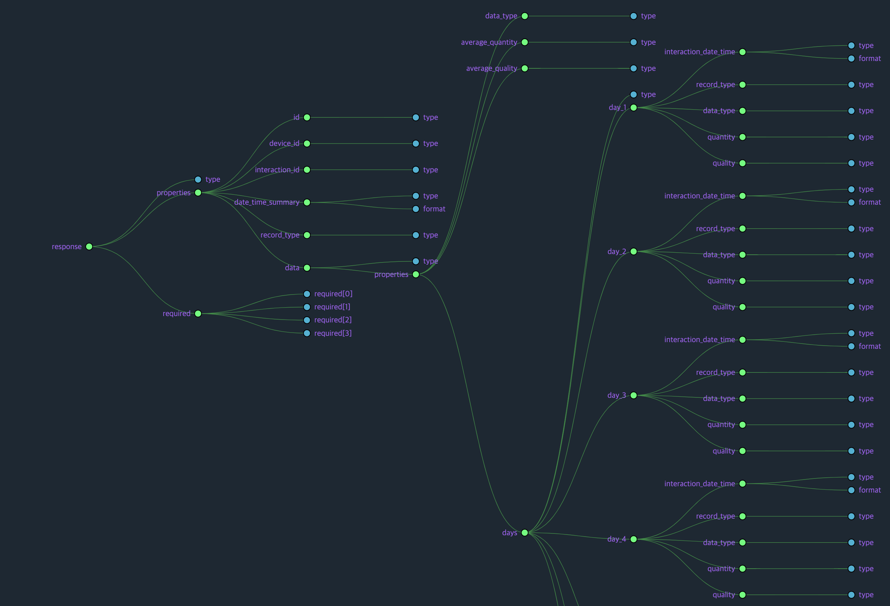

### Two Raw Database Schema
1. Simple Raw Activity Schema (simple_raw_activity.json)
2. Raw Activity Schema that has depedency with data_type, quality and quantity (raw_activity.json)
----
**Basic Description :** 
|Feature      |       Id      | Device ID | Interaction_date_time       | Interaction_id | record_type             | data type | quanitity | quality |
| ---         |      ---      | ---       | ---                         |      ---       |   ---                     | ---       | ---       | ---     |
| Description | Object ID     | Device ID | Date and time that recorded | Caregiver ID   | activity, health, symptom | waking, sleeping,feeling, sleep, fever | miles, hours.. | can be anything 
| Type        | string       | string | string | string(can be number) | string | string | number or string | string|

* Format of date-time is represented as [RFC 3339, section 5.6](https://json-schema.org/draft/2019-09/json-schema-validation.html), and This is a subset of the date format also commonly known as ISO8601 format

* Also, this information can be found in here : [Understanding JSON Schema](https://json-schema.org/understanding-json-schema/UnderstandingJSONSchema.pdf)

* The reason why I put depedency is to make it more categorizable.

----
### Summary Database Schema
1. Simple Summary Activity Schema (simple_summary_activity.json)
2. It can be further developed if the ``days`` dict can be figured out, which it will grab the dictionaries for each days (summary_activity.json)
----

**1. Basic Description(simple_summary_activity):**
|Feature      |       Id      | Device ID | Summary_date_time       | Interaction_id | record_type             | data  | data.data_type | data.average_quanitity | data.average_quality |
| ---         |      ---      | ---       | ---                     |      ---       |   ---                     | ---       | ---       | ---     | --- |
| Description | Object ID     | Device ID | Date and time for summary | Caregiver ID   | *_summary | just dictionary |waking, sleeping,feeling, sleep, fever | miles, hours.. | can be anything 
| Type        | string       | string | string | string(can be number) | string | dict | string | number or string | string|

**2. Basic Description(summary_activity):**
|Feature      |       Id      | Device ID | Summary_date_time       | Interaction_id | record_type             | data  | data.data_type | data.average_quanitity | data.average_quality  | data.days.day_1.interaction_date_time | data.days.day_1.interaction_id | data.days.day_1.data_type | data.days.day_1.quanitity | data.days.day_1.quality |
| ---         |      ---      | ---                     |      ---       |   ---                     | ---       | ---       | ---     | --- | --- | --- | --- | --- | --- | --- |
| Description | Object ID     | Device ID | Date and time for summary | Caregiver ID   | *_summary | just dictionary |waking, sleeping,feeling, sleep, fever | miles, hours.. | can be anything ex : good | interaction date time | interaction ID | walking, sleeping.. | miles, hours ... | can be anything |
| Type        | string       | string | string | string(can be number) | string | dict | string | number or string | string| number | string | number | string | number or string | string |

**Note :**
1. Data is dictionary that stores data type, average quantity, average quality, and days(dictionary).
2. Within Data, there is days dictionary to store all the days(7 days).
3. Each days holds the ``device id``, ``interaction-date-time``, ``interaction-id``, ``data_type``, ``quantity``, and ``quality``

### Testing Summary Activity Database Schema for ``simple_summary_activity.json``

  

### Testing Summary Activity Database Schema for ``summary_activity.json``
* The chart can be drawn by using this [Awesome-JSON-Viewer](https://github.com/rbrahul/Awesome-JSON-Viewer)
* The valid json file is located in the ``/test/test_summary_activity.json``
* If you want to take a look at more days, look at this image ``/img/extension_summary_activity.png``

  

